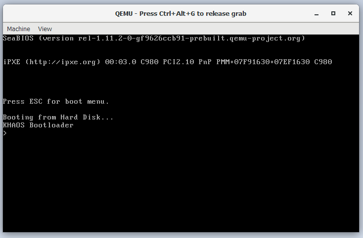
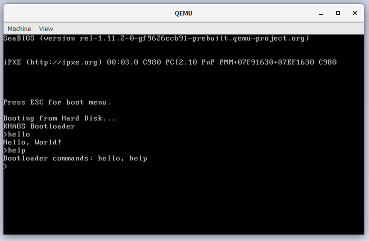
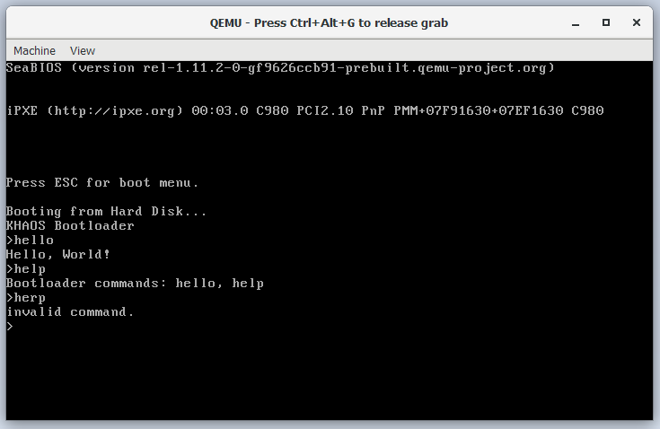

# khaos
A shitty operating system

## Table of Contents

  - [Architecture](./docs/architecture.md)
  - [CPU Modes](./docs/modes.md)

# compile

compile with [NASM assembler](https://www.nasm.us/)  
`$ nasm boot.asm`

# run 

execute with [QEMU emulator](https://www.qemu.org/)  
`$ qemu-system-i386 -boot menu=on boot`  
or `$ qemu-system-x86_64 -boot menu=on boot`  
where `boot` refers to the binary from nasm

# screenshots

