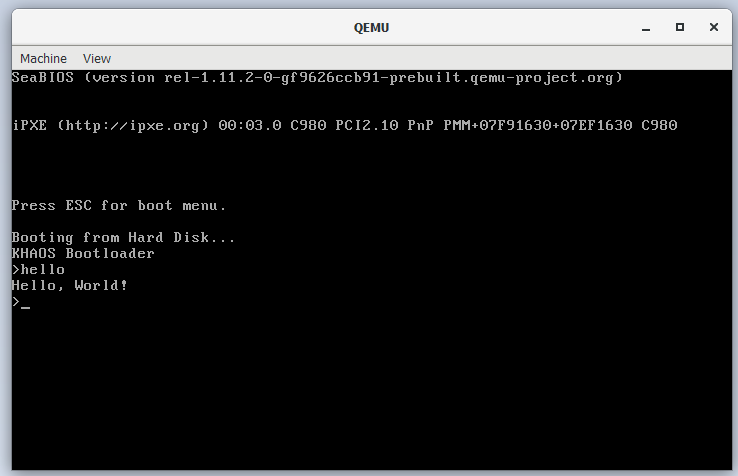

# khaos
A shitty operating system

## Table of Contents

  - [Architecture](./docs/architecture.md)
  - [CPU Modes](./docs/modes.md)

# compile

compile with [NASM assembler](https://www.nasm.us/)  
`$ nasm boot.asm`

# run 

execute with [QEMU emulator](https://www.qemu.org/)  
`$ qemu-system-i386 -boot menu=on boot`  
or `$ qemu-system-x86_64 -boot menu=on boot`  
where `boot` refers to the binary from nasm

# screenshots

# resources

  - [OS Study Guide](http://faculty.salina.k-state.edu/tim/ossg/index.html)
  - [Modern Operating Systems: Global Edition](https://www.amazon.com/Modern-Operating-Systems-Andrew-Tanenbaum/dp/1292061421)
  - [The Design of the UNIX Operating System](https://www.amazon.com/Design-UNIX-Operating-System/dp/0132017997/)
  - [Operating System Concepts](https://www.amazon.com/Operating-System-Concepts-Abraham-Silberschatz/dp/1118063333/)
  - [The Little OS Book](https://littleosbook.github.io/)
  - [OSDev Series](http://www.brokenthorn.com/Resources/OSDevIndex.html)
  - [Programming Your Own OS](https://www.whoishostingthis.com/resources/os-development/)
  - [OSDev.org](https://wiki.osdev.org/Main_Page)
  - [OSDev Reddit](https://www.reddit.com/r/osdev/)
